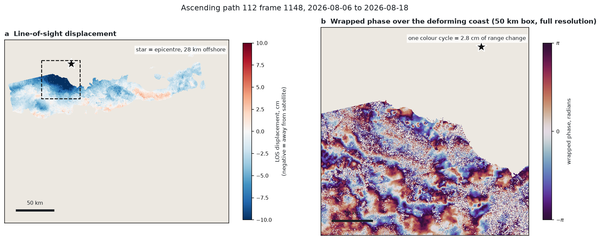
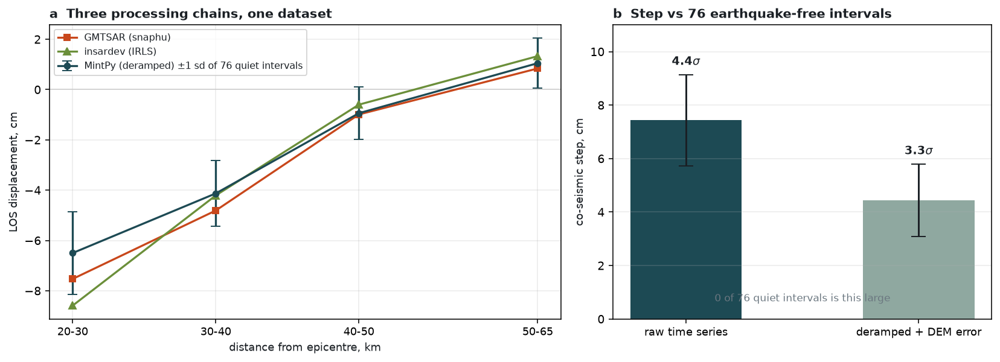
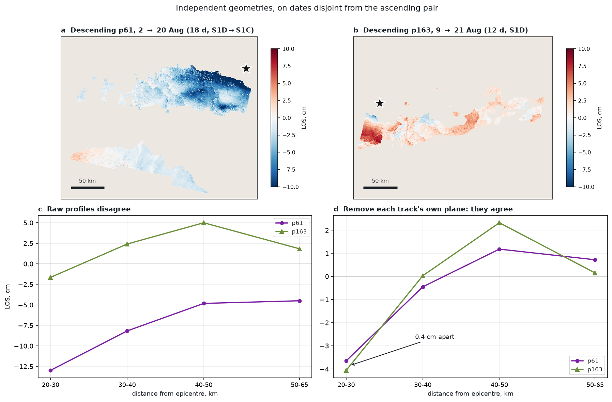
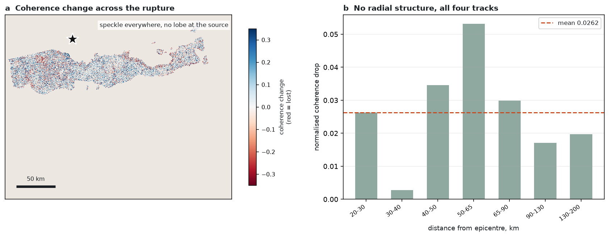
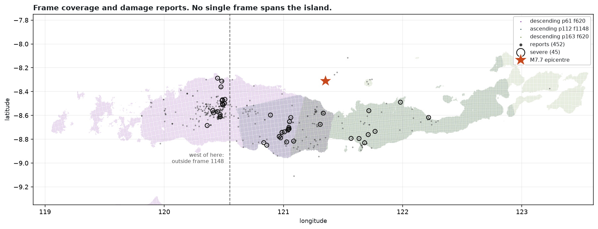

# Flores M7.7, 14 August 2026 — InSAR findings

*Four pages. Every figure quoted here comes from a committed analysis; the
script that produced it is named in brackets. Written 23 August 2026.*

A designed version of this material is also available as
[`docs/flores_artifact.html`](flores_artifact.html) and as four PNG pages in
[`docs/pages/`](pages/).

---

## Page 1 — The measurement

**About 6 cm of line-of-sight ground motion, against 54 cm predicted.**

The USGS finite-fault model predicts roughly 54 cm of line-of-sight
displacement on the north coast of Flores, some 20–30 km from an epicentre
that lies about 28 km offshore. Sentinel-1 measures **4.4 to 8.6 cm** over the
same ground, depending on how the long-wavelength component is treated. The
measurement is secure. The discrepancy is the result: **the model overpredicts
onshore slip by roughly an order of magnitude.**

Radial profiles from three independent processing chains on the ascending
pair (2026-08-06 → 08-18, path 112 frame 1148), in cm:

| ring | GMTSAR | MintPy (deramped) | insardev | 12-day noise sd |
|---|---|---|---|---|
| 20–30 km | −7.53 | −6.50 | −8.59 | 1.65 |
| 30–40 km | −4.81 | −4.13 | −4.21 | 1.30 |
| 40–50 km | −0.99 | −0.94 | −0.60 | 1.05 |
| 50–65 km | +0.84 | +1.05 | +1.33 | 0.99 |

Scatter between chains is 0.69 cm rms against GMTSAR and 1.07 cm against
MintPy — below the 1.25 cm noise floor, except in the 20–30 km ring where the
insardev–MintPy difference reaches 2.09 cm.
*(`insardev_flores_compare.py`)*

**Significance.** A MintPy time series over 78 epochs gives 76 earthquake-free
12-day intervals on this exact frame — the empirical noise of this scene's
atmosphere and orbit errors. The co-seismic step is **−7.43 cm (4.4σ)** raw and
**−4.44 cm (3.3σ)** after linear deramping. **Zero of the 76 quiet intervals is
as large as either.** *(`mintpy_flores_step.py`)*

**The spread is explainable, not scatter.** A linear deramp removes exactly the
long-wavelength component a large earthquake produces, so it eats real signal.
The ordering across chains in the ring where signal is largest is monotonic in
how much deramping was applied: insardev (none) −8.59, GMTSAR (none) −7.53,
MintPy (linear) −6.50. The true value is bracketed rather than uncertain.

**Why this is deformation and not weather.** The geocoded LOS map places the
negative lobe on the stretch of coast nearest the source, decaying east and
away. Atmosphere does not know where the epicentre is. At full resolution the
wrapped phase over that coast resolves into ordered fringes rather than
speckle — coherence there is median 0.410, with 68% of land above 0.3.



*Figure 1. (a) Line-of-sight displacement, frame 1148. The dashed box marks
the zoom in (b). The epicentre lies 28 km offshore, so the nearest land is
~20 km from the source. (b) Wrapped phase over the deforming coast at full
40 m resolution; one colour cycle is 2.8 cm of range change.*



*Figure 2. (a) The three chains against distance from the epicentre; error
bars are ±1 sd of the 76 earthquake-free 12-day intervals. (b) The co-seismic
step before and after deramping, with its significance against that same
empirical noise.*

---

## Page 2 — Why the result is believed

**Three processing chains prove the software. Two more tracks prove the Earth.**

GMTSAR, MintPy and insardev_pygmtsar agree to within 1 cm ring by ring — but
all three consume the *same two acquisitions*. The atmosphere of 18 August is
common to every one of them, so their agreement rules out a processing
artefact and says nothing about a weather one. Reproducibility is not
validity, and treating that agreement as confirmation was the central error to
avoid.

Two descending tracks break the circularity, because neither shares an
acquisition date with the ascending pair:

| track | pair | baseline |
|---|---|---|
| descending p61 f620 | 2 → 20 Aug | 18 d, S1D→S1C cross-mission |
| descending p163 f620 | 9 → 21 Aug | 12 d, S1D, baseline-matched |

Their **raw** profiles disagree completely — p61 runs −12.97/−8.17/−4.82/−4.50,
p163 runs −1.65/+2.41/+5.00/+1.83. After removing each track's own best-fit
plane they converge:

```
p61  de-planed   -3.65  -0.45  +1.18  +0.72
p163 de-planed   -4.06  +0.03  +2.32  +0.15
```

**Agreement to 0.4 cm at 20–30 km.** Each track carries a different
long-wavelength ramp — which is what orbit error and atmosphere look like —
and the same residual underneath. Source-centred structure surviving plane
removal is 4.83 cm on p61 against 0.57 cm in its quiet control (8.5×), and
6.38 against 1.61 on p163 (4.0×). *(`desc61_discriminate.py`)*



*Figure 3. (a, b) LOS displacement on the two descending tracks. (c) Their raw
radial profiles, which disagree completely. (d) The same profiles after
removing each track's own best-fit plane, agreeing to 0.4 cm in the near
field. Different ramps, one residual.*

**A caveat on geometry.** p61 and p163 are both descending, at nearly the same
heading; they differ mainly in incidence angle. The genuine geometric contrast
remains ascending versus descending, and there is no third look direction.

**The limit that nothing so far removes.** Every track has only **one**
post-event epoch. On a single track the co-seismic step and that day's
atmosphere are not separable by any inversion, and three tracks did not change
that. Only a second post-event scene will: two post-event epochs on one track
difference against each other. The next ascending pass is around 30 August.

There was **no emergency tasking**. In the nine days after a M7.7 in a
populated area, exactly five IW SLC scenes touched the near field, all on the
routine 12-day cycle. Every usable one has been processed.
*(`s1_coverage_audit.py`)*

---

## Page 3 — Damage: a mostly negative result

**Coherence change carries no spatial relationship to the rupture.**

Coherence change is a difference of two interferograms over the same ground —
co-event minus a quiet control of identical temporal baseline — so vegetation,
slope and ordinary decorrelation largely cancel. Across all four pairs and
complete island coverage, the normalised coherence drop by distance from the
epicentre:

```
 20-30 km  +0.0263      65-90 km  +0.0299
 30-40 km  +0.0028     90-130 km  +0.0171
 40-50 km  +0.0346    130-200 km  +0.0197
 50-65 km  +0.0532
```

Flat, with the maximum at 50–65 km and the 130–200 km ring matching the near
field. Whatever drives coherence loss here operates uniformly to 200 km. The
control that makes this readable: coherence cannot genuinely *improve* because
of an earthquake, yet 6.8% of pixels gain more than 0.2 against 18.5% losing
it — that gap is the noise floor. *(`island_damage_map.py`)*



*Figure 4. (a) Coherence change across the rupture, ascending frame 1148,
masked to baseline coherence ≥ 0.3. Red is coherence lost. The field is
speckle at every distance, with no lobe at the source — compare Figure 1a,
where the displacement lobe is unmistakable on the same ground. (b) The
radial profile across all four tracks.*

**The limiting number is track-to-track disagreement.** Two tracks observing
the same ground correlate at only r = 0.584, 0.514 and 0.435 on normalised
coherence change — about a third of the variance shared. Any damage signal must
exceed that, and none does.

**Damage reports, and a claim that had to be corrected twice.** The 452
BPBD and community reports are two datasets: 69 damage-classified, and 383 aid
requests from the Geoportal Informasi Kebencanaan whose `damage_level: -1`
means *unclassified*, not undamaged.

I first reported that coherence loss separates badly from lightly damaged
villages, replicated across geometries. That **replication was an illusion** —
the two descending tracks share *zero* reports, because they cover opposite
ends of the island. I then retracted the claim on the grounds that the answer
flipped sign on the 103 villages ascending and p163 both observe. **That
retraction was itself too strong:** with confidence intervals attached, the two
estimates overlap and are not a contradiction.

The correct treatment is presence-only, because unreported ground is not
undamaged ground — it is ground with no people, no signal, or no agency visit.
Using a **target-group background** (presences are severe reports; background is
every *other* report, holding accessibility and population fixed by
construction):

| track | AUC | 95% CI |
|---|---|---|
| asc f1148, n=27 | **0.644** | [0.539, 0.744] |
| desc61, n=32 | 0.591 | [0.475, 0.716] |
| desc163, n=11 | 0.440 | [0.272, 0.598] |

Controlling reporting bias *strengthens* the ascending result (0.591 → 0.644);
an accessibility artefact would have weakened it. **What stands: a modest, real
effect on the best-powered track. Not a replication, and not a damage
probability.** *(`eq_reports_presence_only.py`)*

Converting this into "how likely was this place damaged" requires **confirmed
absences** — field visits recording that places which filed no report were
undamaged. That is a field problem; more interferograms cannot fix it.

---

## Page 4 — Coverage, corrections, and what is open

**No single frame covers Flores.** The island runs ~340 km east–west and an IW
frame is ~250 km across, so longitude is what gets cut — latitude range says
nothing about it. Frame 1148, the primary frame, spans 120.55–123.21 and
contains 191 of 452 reports. The western third, including Labuan Bajo and the
Manggarai highlands where the largest cluster of 235 reports sits, is outside
it. Complete coverage needs ascending *and* descending; all four products
together reach 452/452. *(`island_coverage.py`)*



*Figure 5. Coherent ground in each of the three frames, with the 452 damage
and aid reports. Descending p61 (purple) reaches the western third that frame
1148 (teal) never sees; p163 (green) reaches the eastern tip. The two
descending tracks barely overlap, which is why they share no reports and why
the apparent "replication" in the damage analysis was an illusion.*

**Sentinel-1C has never recorded frame 620** on descending path 163 — 0 of 8
passes since May. The path is flown under two segment plans and S1C always
uses the one with a hole over Flores; S1D managed 4 of 7. The constellation's
nominal 6-day revisit does not apply to this ground.

### Errors caught, and what caught them

| error | what it was | caught by |
|---|---|---|
| Frame chosen for containing the **epicentre** | the epicentre is offshore; that frame held 4.9% of the deforming ground | land-coverage test |
| Four-block cluster of the largest coherence drops | all at 0 m elevation, 0° slope, 100 m from the sea — shoreline | terrain check |
| "Three chains agree" read as confirmation | all three share the same two acquisitions | stating the confound first |
| Coherence–damage replication | the two descending tracks share zero reports | common-report test |
| That retraction, too strong | intervals overlap; two noisy estimates are not a contradiction | presence-only re-analysis |
| Submit guard keyed on job names | same granules under a new label would have re-bought 30 credits | granule-pair keying |
| `include_los_displacement` recorded but ignored | HyP3 accepts the deprecated parameter and delivers no band | checking the delivered file list |
| Damage-map legend said blue for loss | `RdBu` maps low values to red; the map read backwards | reading the figure |
| Six hours of deliverables written to an uncommitted working tree | a one-way mirror deleted every file not in the source checkout | the files disappearing |

Nine predictions were registered in `docs/desc163_predictions.md` while the
final products were still `PENDING`; **five held.** Two failures moved the
argument forward — the baseline-matched coherence drop came out at −0.0078
rather than the predicted +0.012 to +0.022, confirming more strongly than
expected that p61's +0.0338 was a baseline artefact — and one forced the
retraction above.

### Still open

- **Second post-event epoch, ~30 August (ascending).** The only thing that
  separates the co-seismic step from one day's atmosphere. Worth more than any
  reprocessing of what exists.
- **ERA5 tropospheric correction** — unpublished for 18 August at the time of
  the run; the 6 August grib is cached.
- **Precise orbits, ~7 September.** Would collapse the plane/signal degeneracy
  that costs 2–3 cm on every profile.
- **Two landslide candidates** — −8.7046/121.5505 at 49 km and
  −8.7226/122.2152 at 106 km. Steep (32° and 36° against a scene median of
  17.5°), unreported, and seen in both baseline-matched tracks. Has anyone
  been to them?

### The methodological point

Reproducibility is not validity. Three implementations of the same algorithms
on the same two files agreed to within 1 cm, and that agreement said nothing
about the atmosphere they all shared. Every genuine advance here came from a
control that could have failed: a quiet interval, a disjoint acquisition date,
a background drawn from the same sampling process, or a terrain check on a
result that looked too good.
