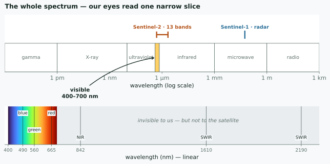
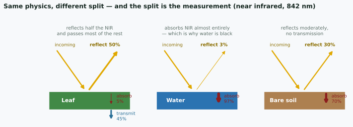
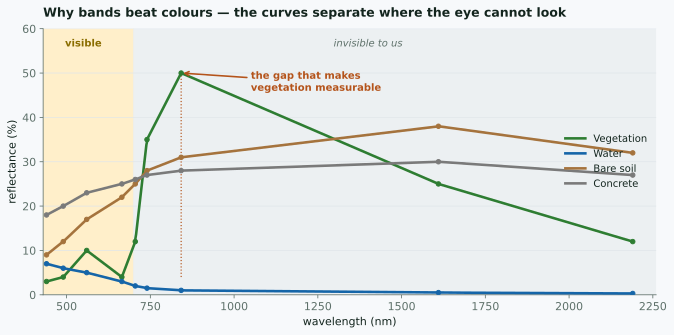
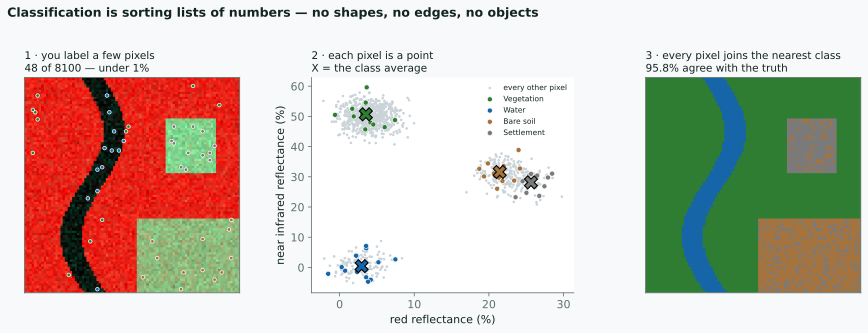

## Two days {background-color="#f7f9fb"}

::: {.columns}
::: {.column width="50%"}
### Day 1 — Concepts
2 hours · **no maps produced**

Output: understanding *why* Earth Engine code looks the way it does.
:::
::: {.column width="50%"}
### Day 2 — Hands-on
2 hours · everyone types

Output: a land cover map of your own district, and files for your report.
:::
:::

. . .

Skip Day 1 and tomorrow's scripts still run — until you change the area, hit an
error, and have no way to guess where it came from.

# 1 · How we see {background-color="#0f3d2e"}

## Start with your own eye

You are already using a remote sensing instrument.

. . .

Light leaves the sun, hits a leaf, and some of it comes back. Your eye
measures what came back. You never touch the leaf.

. . .

**That is the whole idea.** A satellite does the same thing from 786 km up.
Everything else is detail — which wavelengths, how finely, how often.

## Colour is not in the light

Sunlight is a continuous range of wavelengths. There are no colours in it.

. . .

Your retina has **three** kinds of cone, sensitive around blue, green and red.
Every colour you have ever seen is your brain interpreting **three numbers**.

. . .

::: {.callout-note}
## The useful consequence
Colour is a property of the **sensor**, not of the world. Build a different
sensor and you get different colours — and possibly a better answer.
:::

## Our sliver of it

{fig-align="center" width="92%"}

::: {.fragment}
Visible light is about 400–700 nm. The satellite measures out to 2190 nm —
**three times further than your eye reaches.**
:::

## A satellite has more cones

| | our eye | Sentinel-2 |
|---|---|---|
| detectors | 3 | 13 |
| blue | ~440 nm | 490 nm |
| green | ~540 nm | 560 nm |
| red | ~570 nm | 665 nm |
| near infrared | — | **842 nm** |
| shortwave infrared | — | **1610, 2190 nm** |

::: {.fragment}
The rows without a left-hand entry are the point of the whole exercise.
:::

## What happens when light meets a surface

Three things, always, and they must add to 100%:

**reflected** · **absorbed** · **transmitted**

. . .

{fig-align="center" width="94%"}

. . .

The physics is identical for all three. **Only the split differs** — and that
split is what the satellite measures.

## Only the reflected part reaches the satellite

::: {.callout-note}
## Which is why water is black in the near infrared
It absorbs 97% of it. Nothing comes back, so the sensor records almost
nothing — and that makes water the easiest thing on Earth to map.
:::

. . .

A leaf passes 45% of the near infrared straight through. Light we cannot see
goes through a leaf almost as if it were glass.

## The image is numbers, not a picture

A satellite image is not a photograph. It is a **grid of measurements**.

. . .

Each cell holds how much energy came back, in one wavelength range, as an
integer — a **digital number**.

. . .

```
B4 (red), a 4×4 corner of a Sentinel-2 scene

  412  455  398  377
  401  1122 1180 402      ← the bright cells are a rooftop
  388  1195 1240 395
  377  402  410  388
```

Nothing here is red. Nothing here is a picture. It is a matrix.

## Why numbers are better than a picture

::: {.columns}
::: {.column width="50%"}
**A picture** you can look at.
:::
::: {.column width="50%"}
**A number** you can subtract, threshold, average over ten years, and compare
between two dates.
:::
:::

. . .

Film could not do arithmetic. This is the reason remote sensing became
digital, and the reason a computer can find change that your eye would miss.

. . .

::: {.callout-important}
## Everything later in these two days is arithmetic on those matrices
:::

## Choosing what to show

Your screen has three channels: R, G, B. Sentinel-2 has thirteen bands.

. . .

So displaying an image is an **act of choosing**. You pick three bands and
assign them to the three channels.

```js
// natural colour — what your eye would see
{bands: ['B4', 'B3', 'B2'], min: 0, max: 3000}

// false colour — near infrared into the red channel
{bands: ['B8', 'B4', 'B3'], min: 0, max: 3000}
```

. . .

The second one is not a trick or a prettier version. It is **the only way to
put an invisible measurement in front of a human eye**.

## The band you cannot see

Healthy vegetation, roughly:

| wavelength | reflected |
|---|---:|
| red, 665 nm | ~5% |
| **near infrared, 842 nm** | **~50%** |

. . .

A leaf is dark in red — chlorophyll absorbs it, that is what photosynthesis
*is*. Its internal cell structure scatters near infrared straight back.

. . .

::: {.callout-note}
## Your eye stops at about 700 nm
The strongest signal a plant gives off is just past where your vision ends.
Vegetation studies live in a band no human has ever seen.
:::

## Four surfaces, measured

{fig-align="center" width="92%"}

::: {.fragment}
In the visible band the four curves crowd together. Past 700 nm they separate.
**That is the whole argument for multispectral imaging.**
:::

## Why false colour looks like that

In `['B8','B4','B3']`, near infrared drives the red channel.

. . .

- healthy vegetation → **bright red**
- water → near black (water absorbs NIR almost completely)
- bare soil, roofs, roads → cyan, grey, brown

. . .

Once you know that, a false-colour image is faster to read than a natural
one. Deforestation stops being subtle.

## Every pixel is a list of numbers

Stack the bands and look down through them at one cell:

```
pixel (1204, 887)

  B2   B3   B4   B8   B11  B12
  412  620  455  3180 1420 690
```

. . .

Six numbers. A **vector**. That pixel's signature.

. . .

Forest, water, rice paddy and rooftop each have a characteristic shape to that
list — and the shape survives even when the brightness changes.

## Classification is sorting those lists

::: {.columns}
::: {.column width="55%"}
1. you label a few pixels you are sure about
2. the computer learns what each class's numbers look like
3. it assigns **every** remaining pixel to the nearest class
:::
::: {.column width="45%"}
::: {.fragment}
No image recognition. No shapes, no edges, no objects.

Just: *which group of numbers is this list closest to?*
:::
:::
:::

. . .

Tomorrow you will do exactly this, in about fifteen lines of code.

## The whole algorithm, in one figure

{fig-align="center" width="96%"}

::: {.fragment}
48 labelled pixels out of 8100 — under 1% — and 95.8% of the rest land in the
right class.
:::

## Look at the middle panel again

Vegetation and water sit far apart. Nothing can confuse them.

. . .

**Bare soil and settlement overlap.** Their numbers are genuinely similar —
both are dry, bright surfaces with moderate infrared.

. . .

::: {.callout-important}
## That overlap is your error, and no algorithm removes it
It shows up as speckle in the right-hand panel. When your accuracy stalls at
80%, look for the two classes sitting on top of each other in band space —
then add a band that separates them, or merge them and say so.
:::

## Which is why more bands help

Two bands give a flat scatter plot. Sentinel-2 gives you thirteen.

. . .

Soil and settlement that overlap in red and near infrared may separate in
**shortwave infrared**, where moisture and material differ.

. . .

You are not choosing prettier colours. You are choosing **axes that pull your
classes apart**.

## So the vocabulary is set {background-color="#f7f9fb"}

| word | what it actually means |
|---|---|
| band | one wavelength range, one matrix |
| digital number | one measurement in one cell |
| RGB visualisation | choosing three matrices to show |
| false colour | putting an invisible band on screen |
| classification | grouping pixels by their list of numbers |

::: {.fragment}
Everything from here is how to do that arithmetic **without downloading
anything**.
:::

# 2 · Why Earth Engine {background-color="#0f3d2e"}

## The old way

Mapping land change for one district, ten years:

1. find scenes in a portal, one by one
2. download — tens to hundreds of GB
3. radiometric and atmospheric correction, per scene
4. mosaic, clip to the boundary
5. **only now start the analysis**
6. repeat everything if the area needs extending

## What changes

::: {.callout-important}
## Not download speed

What changes is that **there is no download at all**.
:::

. . .

The imagery is already there, already corrected.

You send an **instruction** — the computation travels to the data, not the
other way round.

. . .

Consequence: **the computing does not happen on your machine.**
That is what makes it feel strange at first.

## Free, and already loaded

| Data | Resolution | Since | Good for |
|------|-----------:|------:|----------|
| Sentinel-2 | 10 m | 2015 | land cover, vegetation |
| Landsat 8/9 | 30 m | 2013 | long consistent records |
| Landsat 5/7 | 30 m | 1984 | decadal change |
| **Sentinel-1** | 10 m | 2014 | **radar — sees through cloud** |
| CHIRPS | 5 km | 1981 | rainfall |

::: {.fragment}
For Indonesia the radar row often decides things: half the year our sky is
covered.
:::

# 3 · The Code Editor {background-color="#0f3d2e"}

## Four panels

| Panel | Where | What |
|-------|-------|------|
| **Scripts** | top left | your saved scripts, examples |
| **Docs** | left tab | every function — this *is* the reference |
| **Editor** | centre | where you write |
| **Console** | top right | `print` output, error messages |
| **Inspector** | right tab | click the map → pixel values |
| **Tasks** | right tab | exports waiting to run |

## Two habits that save hours

**Inspector** — the fastest way to ask "is this number sensible?"

> Click on the sea, see NDVI negative → your calculation is right.

. . .

**Tasks** — `Export` in a script does **not** export.

> It only *queues*. You still click **RUN** in the Tasks tab.

::: {.fragment .fade-in}
This is the number one complaint at every GEE workshop. Without exception.
:::

# 4 · Just enough JavaScript {background-color="#0f3d2e"}

## Six things, that's all

```javascript
var city = 'Maumere';        // text
var year = 2024;             // number

var bands = ['B4','B3','B2'];   // list — starts at ZERO
print(bands[0]);                // 'B4'

var visual = {min: 0, max: 3000};   // dictionary
```

::: {.fragment}
Counting starts at **zero** — mistake number one for anyone coming from
spreadsheets.
:::

## Functions and chaining

```javascript
function addNDVI (image) {
  var ndvi = image.normalizedDifference(['B8','B4']);
  return image.addBands(ndvi.rename('NDVI'));
}
```

. . .

```javascript
var image = ee.ImageCollection('COPERNICUS/S2_SR_HARMONIZED')
              .filterBounds(aoi)
              .filterDate('2024-06-01', '2024-09-30')
              .median();
```

A leading dot means "then do this to the result above". Read it top to bottom,
like a sentence.

# 5 · Client vs Server {background-color="#7d2b2b"}

## If you remember one thing today

::: {.callout-important}
## This is it

Most confusing Earth Engine errors come from here — and none of them can be
solved by copying someone else's script.
:::

## Two worlds, one script

::: {.columns}
::: {.column width="50%"}
### Client
your browser

`var`, plain numbers, `if`, `for`, text
:::
::: {.column width="50%"}
### Server
Google's computers

everything starting with **`ee.`**
:::
:::

. . .

An `ee.` object **holds no value** in your browser.

It holds a **recipe**: a note about a computation to be done later, over there.

## See the difference

```javascript
var a = 5;                // client: actually contains 5
var b = ee.Number(5);     // server: a recipe that will produce 5

print(a + 1);             // 6
print(b.add(1));          // 6 — by a completely different route
```

::: {.fragment}
Note `b.add(1)`, **not** `b + 1`.
:::

## What does not work

```javascript
var collection = ee.ImageCollection('COPERNICUS/S2_SR_HARMONIZED');

if (collection.size() > 100) {      // ← WRONG
  print('plenty of images');
}
```

. . .

`collection.size()` is not a number. It is a **promise to count**, later, on the
server.

`if` runs **now**, in the browser — judging something that does not exist yet.

::: {.fragment .fade-in}
The dangerous part: the script still "runs". No clear error.
:::

## The rule of thumb {background-color="#f7f9fb"}

::: {.callout-tip}
## One sentence is enough

If the name starts with **`ee.`**, do not use `if`, `for`, or plain
`+ - * /` on it.

Use its own methods: `.add()` `.subtract()` `.gt()` `.map()`
:::

. . .

Almost every *"why is my result empty?"* starts here.

And once it clicks, the Earth Engine documentation stops being confusing — the
whole API is organised around this split.

# Before tomorrow {background-color="#0f3d2e"}

## Ten minutes

1. New script, name it `day-1-practice`
2. `print` your district name
3. Display one Sentinel-2 image over your area
4. Open **Inspector**, click a point on the map
5. In the Console, expand `print(image)` and look inside

. . .

If step 5 is confusing — that is the point:

> what gets printed is not a picture, it is a **description** of one.

## Tomorrow {background-color="#f7f9fb"}

| Minutes | Output |
|--------:|--------|
| 0–20 | cloud-free Sentinel-2 composite |
| 20–40 | NDVI map + time series chart |
| 40–70 | **land cover map + accuracy figures** |
| 70–95 | change map between two years |
| 95–120 | GeoTIFF & PNG for your report |

::: {.fragment}
All for **your own working area**.
:::

## {background-color="#0f3d2e"}

::: {style="text-align:center; margin-top:2em"}
### See you tomorrow

[firmanhadi21.github.io/rs-change-detection/gee-js](https://firmanhadi21.github.io/rs-change-detection/gee-js/)

Materials, scripts and references are all there.
:::
